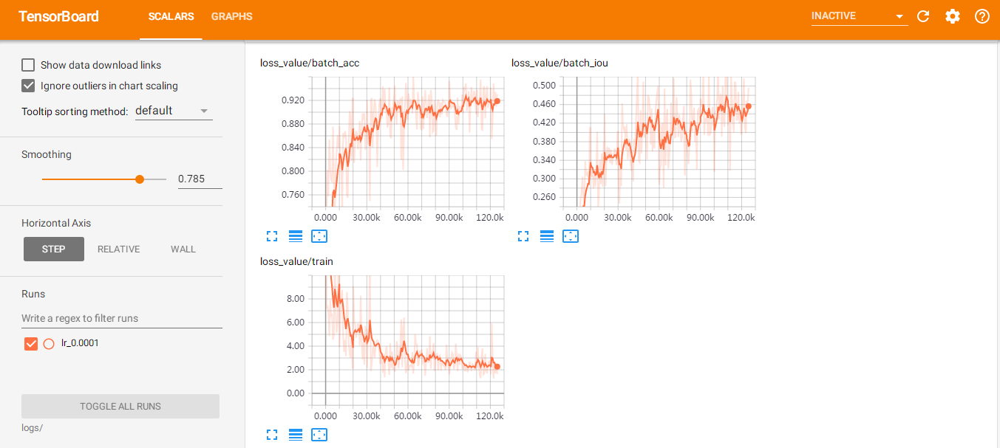

This repo aims to help train the erfnet to solve  pixel-level  semantic segmentation task based on cityspace dataset.

*requirements.txt* gives all the dependencies.<br>
All the logs and model can be downloaded [here](https://pan.baidu.com/s/1ui5VP0zol5uCVrat5r9Bog). password:du23  


# How to train erfnet based on cityspace(only Fine annotations)? 
## Fetch data
- download dataset from [cityscapes](https://www.cityscapes-dataset.com/dataset-overview/)

## Install cityscapes tools, and run the createTrainIdLabelImgs.py to generate trainId png files according to their *_polygons.json under the gtFine folder
```bash
git clone https://github.com/mcordts/cityscapesScripts.git  
export CITYSCAPES_DATASET=/home/jst/share/project/tensorflow/Mask_RCNN-master/data/
```

```python
python createTrainIdLabelImgs.py  
```

> I have changed the trainID-labelID correspondence in cityscapesScripts/cityscapesscripts/helpers/label.py  
their correspondence is defined in the train_py/cfg/cityscapes/data.yaml

## Put all the train data under data folder and run the jst_erf_data.py to unify suffix of their filename
```python
python jst_erf_data.py /path/to/png/file/  
```

## Rearrange the file
- as the following folder structure(img->origin png files, lbl->trainId png file)  
data  
--------train:  
----------------lbl  
----------------img  
--------val:   
----------------lbl  
----------------img  
--------test:  
----------------lbl  
----------------img  

## Run the training script  
- [cnn_train.py -d data.yaml -n net.yaml -t train.yaml -l /tmp/path/to/log/ -p /tmp/path/to/pretrained]
```python
python3 cnn_train.py -d cfg/cityscapes/data.yaml -n cfg/cityscapes/net_bonnet.yaml -t cfg/cityscapes/train_bonnet.yaml -l logs/  
```

- after hours of training, you will get the trained model under logs/iou folder, the training loss is as below:    
  

# How to run the erfnet inference model?  
## Get all the test image file
```bash
find /home/jst/share/project/tensorflow/Mask_RCNN/data/leftImg8bit/test/ -name "*.png" > test.list  
```

## Run the inference script  
- [cnn_use.py -l /tmp/path/to/log/ -p /tmp/path/to/pretrained -i /path/to/image]  
```bash
mkdir temp_logs
```
```python
python3 cnn_use.py  -l temp_logs -p logs -i /home/jst/share/project/tensorflow/Mask_RCNN-master/data/test.list  
```

- you will get the predicted mask png file under *temp_logs* folder.
